# Yodeck Digital Signage Platform Guide

This guide outlines features and screens of the Yodeck Digital Signage Platform, sequenced according to the images provided in the mapping file (`new.md`).

## 1. Sample Wifi Scan App Preview
- Shows the QR code for WiFi.

## 2. Apps List
- Shows "Sample Wifi Scan" and "Retail Store Time" apps.
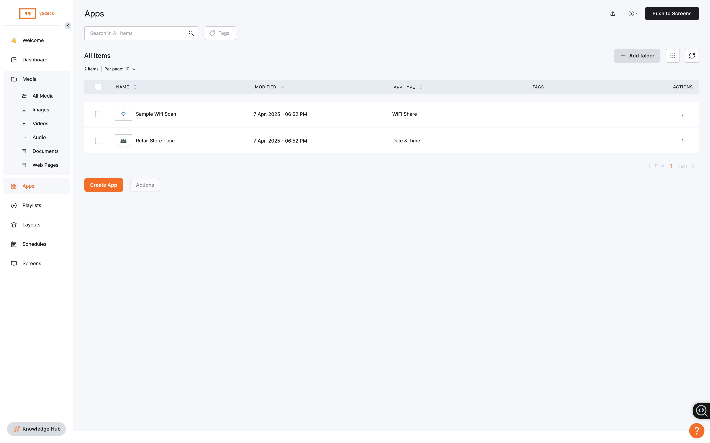

## 3. Images List
- Shows "Sample Retail Discounts" and "Sample Shopping Cart" images.
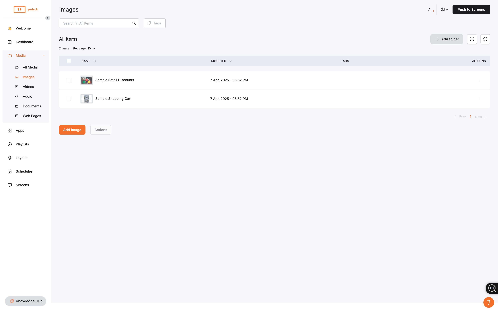

## 4. Playlist Details - List View
- Shows playlist structure with content selection on left, playlist items on right.

## 5. Playlist Details - Edit View 1
- Shows Name, Description, Transition, Playback options for a playlist.

## 6. Document Upload Popup
- Shows options for uploading PDF, Word, PPT, Excel.
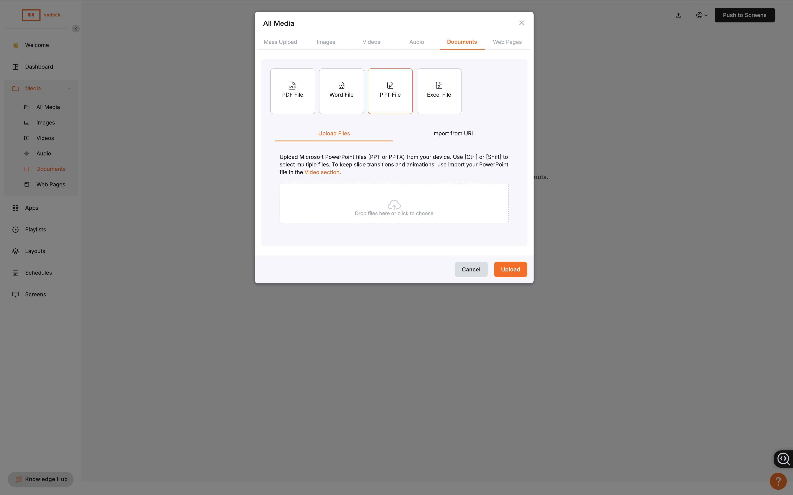

## 7. Image Actions
- Shows the dropdown menu: Edit, Add to Playlist, etc. for an image.
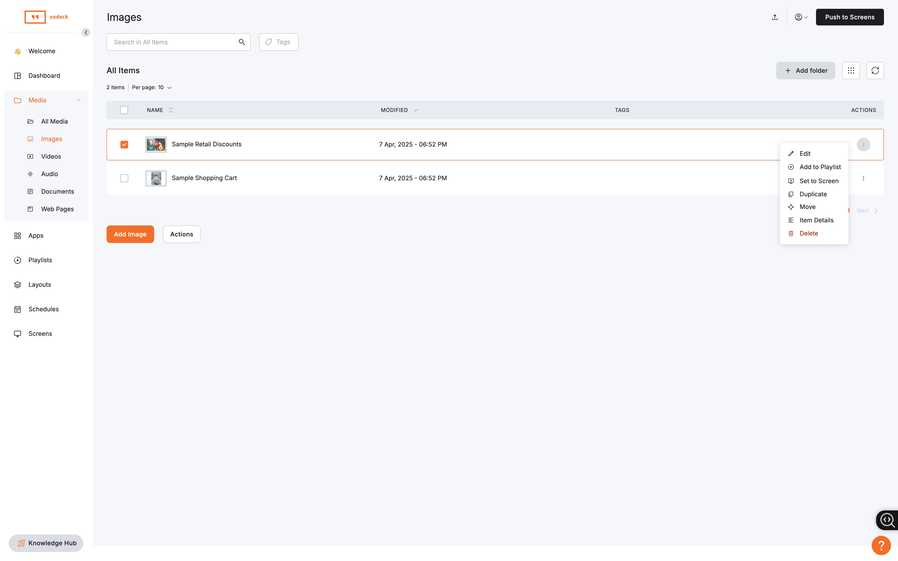

## 8. Schedules Calendar
- Shows the empty weekly schedule grid.
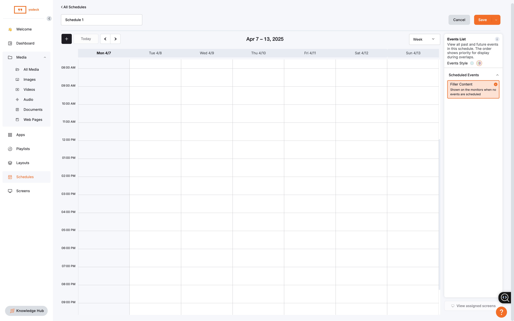

## 9. All Media list
- Shows overview, overview, discounts, cart, checkout video, retail video.

## 10. Welcome - Step 4 of 5 - Number of Screens
- Asks "How many screens...".
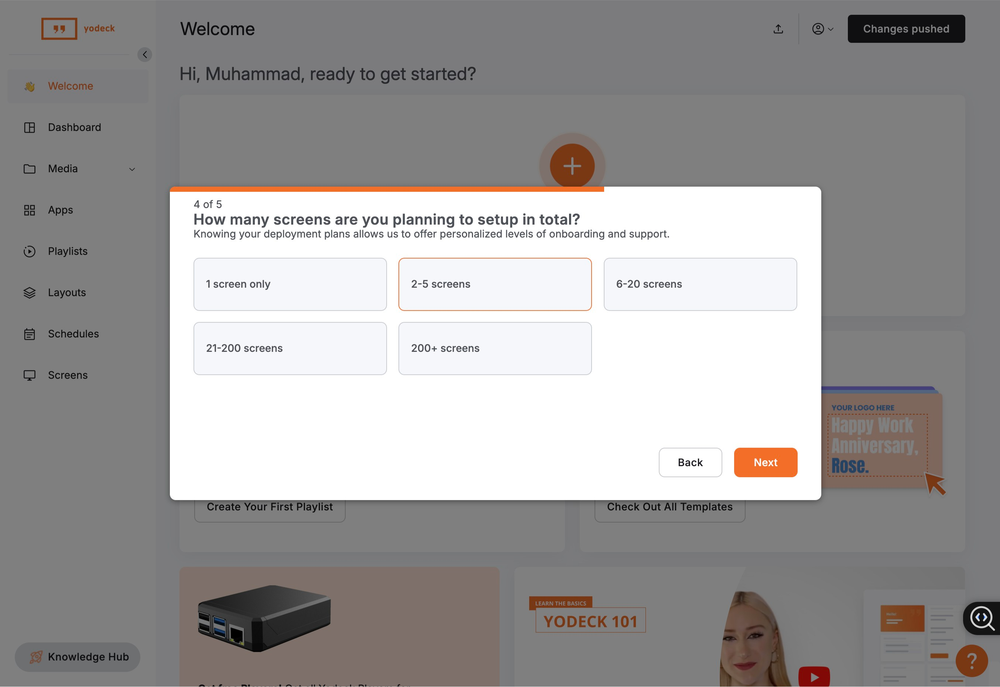

## 11. Welcome - Step 3 of 5 - Organization Size
- Asks "What is the size...".
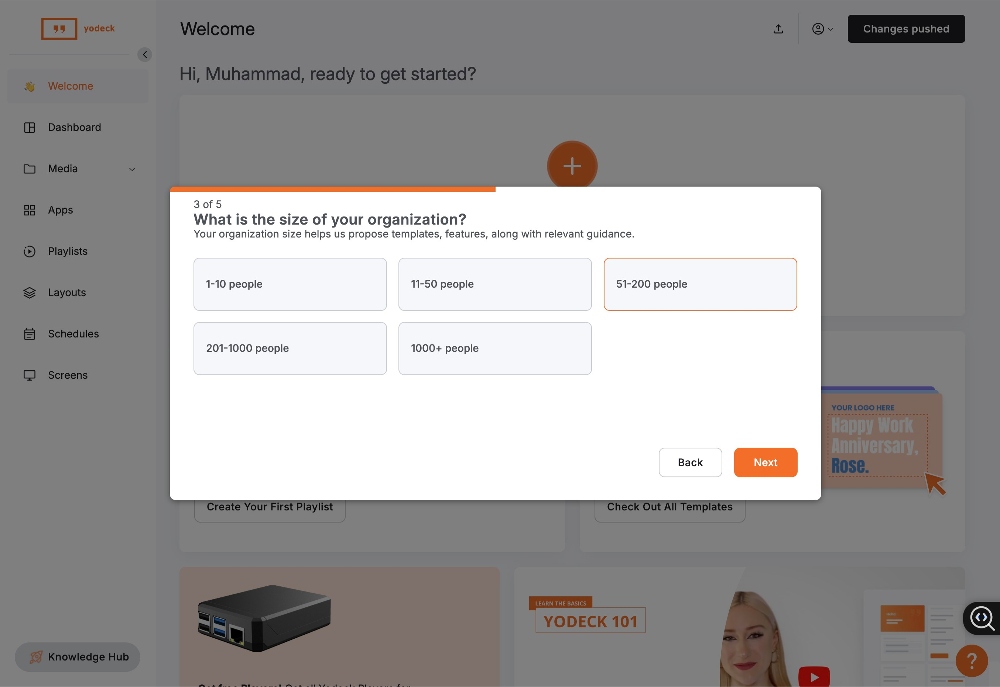

## 12. New Event Popup
- Modal for creating a new schedule event.

## 13. Screens - No Screens Added
- Shows "You don't have any Screens.".

## 14. Playlist Details - Edit View 2
- Same as Image 5 - showing playlist settings.
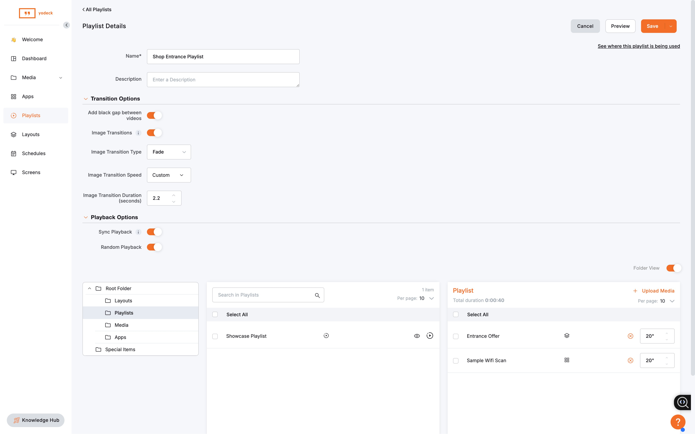

## 15. Welcome - Step 2 of 5 - Industry
- Asks "What industry...".
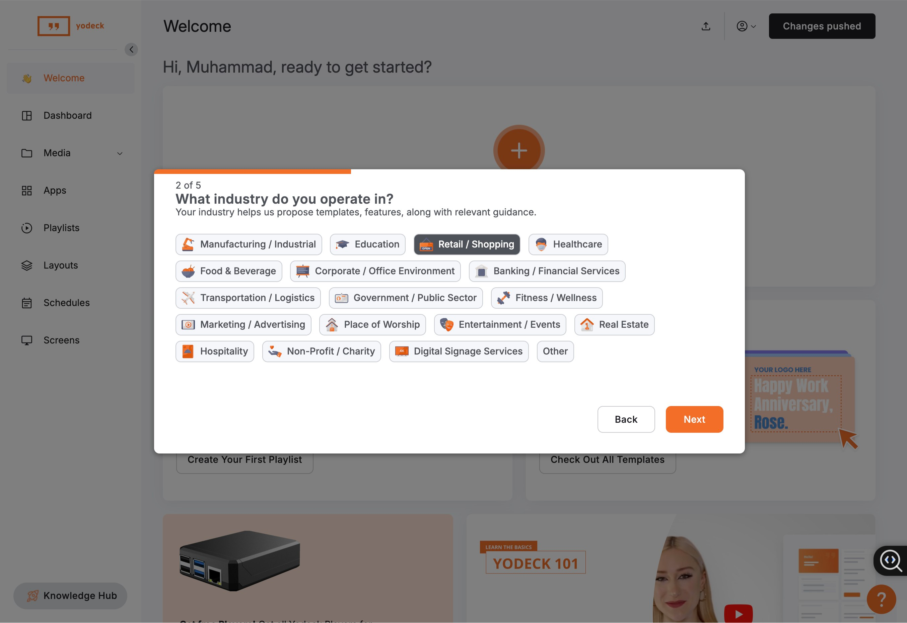

## 16. Welcome - Main
- Shows main welcome screen with "Add a Screen", "Create Playlist", "Check Templates".

## 17. Welcome - Step 5 of 5 - Screen Usage
- Asks "Where and how do you plan...".
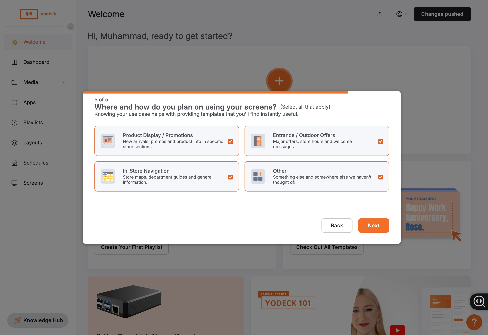

## 18. Welcome - You are all set!
- Onboarding completion message.
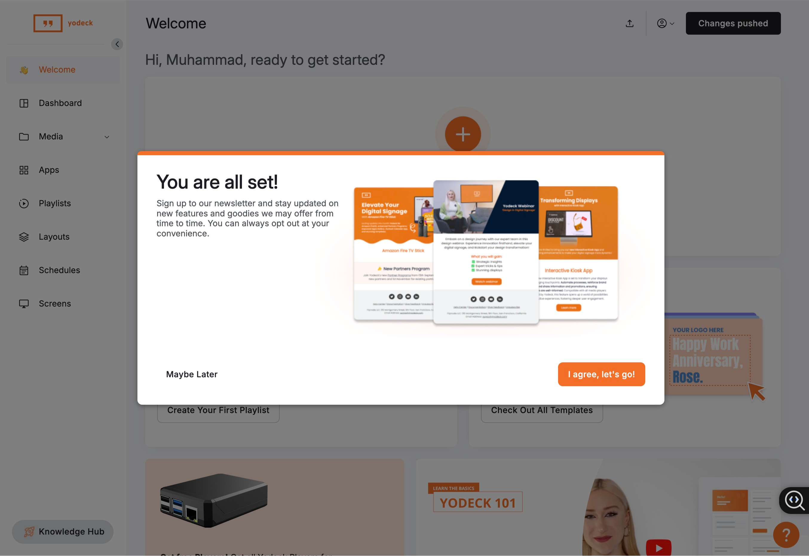

## 19. Layout Editor - Advanced Tab
- Layout editor showing Availability settings on the right.
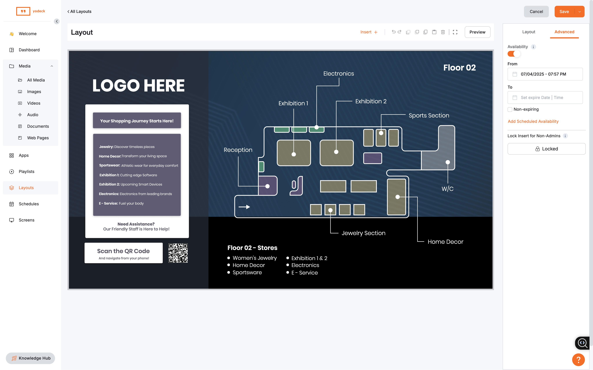

## 20. Layout Editor - Layout Tab
- Layout editor showing layout element properties on the right.

## 21. Dashboard
- Shows main dashboard with map, screen status, subscription.

## 22. Summer Sale Ad
- Example final output graphic with sunglasses.
