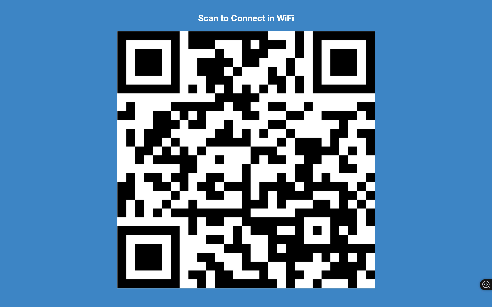

Here is the mapping based on the order of images in your second prompt:

Image 1: Sample Wifi Scan App Preview (Shows the QR code for WiFi)

Image 2: Apps List (Shows "Sample Wifi Scan" and "Retail Store Time" apps)
image-17.png

Image 3: Images List (Shows "Sample Retail Discounts" and "Sample Shopping Cart" images)
image-20.png

Image 4: Playlist Details - List View (Shows playlist structure with content selection on left, playlist items on right)
image-4.png

Image 5: Playlist Details - Edit View 1 (Shows Name, Description, Transition, Playback options for a playlist)
image-5.png

Image 6: Document Upload Popup (Shows options for uploading PDF, Word, PPT, Excel)
image-18.png

Image 7: Image Actions (Shows the dropdown menu: Edit, Add to Playlist, etc. for an image)
image-19.png

Image 8: Schedules Calendar (Shows the empty weekly schedule grid)
Image-14.png

Image 9: All Media list (Shows overview, overview, discounts, cart, checkout video, retail video)
Image-21.png

Image 10: Welcome - Step 4 of 5 - Number of Screens (Asks "How many screens...")
Image-9.png

Image 11: Welcome - Step 3 of 5 - Organization Size (Asks "What is the size...")
Image-10.png

Image 12: New Event Popup (Modal for creating a new schedule event)
Image-13.png

Image 13: Screens - No Screens Added (Shows "You don't have any Screens.")
Image-12.png

Image 14: Playlist Details - Edit View 2 (Same as Image 5 - showing playlist settings)
Image-3.png

Image 15: Welcome - Step 2 of 5 - Industry (Asks "What industry...")
Image.png

Image 16: Welcome - Main (Shows main welcome screen with "Add a Screen", "Create Playlist", "Check Templates")
Image-6.png

Image 17: Welcome - Step 5 of 5 - Screen Usage (Asks "Where and how do you plan...")
Image-8.png

Image 18: Welcome - You are all set! (Onboarding completion message)
Image-7.png

Image 19: Layout Editor - Advanced Tab (Layout editor showing Availability settings on the right)
Image-15.png

Image 20: Layout Editor - Layout Tab (Layout editor showing layout element properties on the right)
Image-16.png

Image 21: Dashboard (Shows main dashboard with map, screen status, subscription)
Image-11.png

Image 22: Summer Sale Ad (Example final output graphic with sunglasses)
Image-2.png

This list directly links the number of the image as it appeared in your second request to the description used in the workflow.